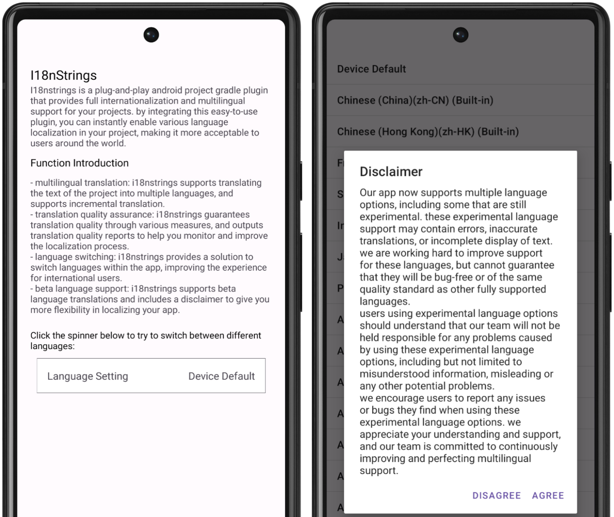
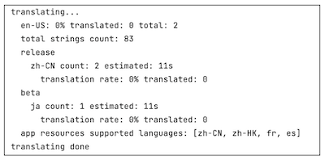

[中文](README_CN.md)

# I18nStrings

**I18nStrings** is a plug-and-play Android engineering Gradle plugin designed to provide your project with comprehensive internationalization and multilingual support solutions. By integrating this user-friendly plugin, you can instantly activate extensive language localization features for your project, further encouraging acceptance and use by global users.

## Features

- **Multilingual Translation**: I18nStrings supports multilingual translation of project texts and can perform incremental translation.
- **Translation Quality Assurance**: Through multiple measures, I18nStrings ensures high-quality translations, optimizing multilingual support effects ([Details: Translation Quality Assurance](doc/quality.md)).
- **Language Switching**: I18nStrings offers an integrated solution for switching languages within the app, and supports dynamic translation of languages, enhancing the user experience for international users.
- **Beta Language Support**: I18nStrings' Beta language translation feature comes with a disclaimer, giving the application more flexibility in localization from a product perspective.

  

## Quick Start

1. **Add Dependency**: In the project's root directory `build.gradle`, add the following code:

```kotlin
dependencies {
   ...
   classpath("com.appkim.i18nstrings:plugin:0.0.7")
}
```

2. **Add Plugin Support**: In the main module (usually the app module) `build.gradle`, add:

```kotlin
plugins {
   ... id("com.appkim.i18nstrings")
}
```

3. **Run Task**: Execute `./gradlew :app:i18nStrings` in the command line or select `app` (main module name) -> `other` -> `i18nStrings` in Android Studio and double-click to run.

   

4. **Additional Configuration**: You can also add `i18nStrings` configuration to the main module's `build.gradle`, customizing task modification.

```kotlin Sample code
/**
 * Define custom extension property class to configure multilingual translation options.
 *
 * release and beta fields accept the following values:
 *    - "default": Default value, will read the multilingual directory existing in the app module under release, as the list of languages to be translated.
 *    - "suggest": Recommended translation languages, including Simplified Chinese, French, German, Indonesian, Japanese, Portuguese, Spanish, etc.
 *    - "all": All supported translation languages, totaling over 100. Please note that for 600 texts, translation may take 1-2 hours, so the "suggest" option is recommended.
 *    - Custom language list, using commas to separate, such as: "zh-rCN,fr,de,id,ja,pt,es".
 */
i18nStrings {
   release = "zh-rCN, fr, es" // Configure translation languages, output to corresponding values folder. Default value is "default".
   beta = "ja, pt" // Configure beta version translation languages, output to main project's assets directory, to be used with com.appkim.i18nstrings.ui library.
   betaPath = "../out/test" // Customize beta translation file output path.
   excludeProjects = "mylibrary" // Will translate all modules in the project by default, use this option to exclude specific modules.
   onlySupportedStringsXml = true // Default is true, only recognizes strings.xml files.
   excludeXmls = "" // When onlySupportedStringsXml is false, this field can be used to exclude specific xml files.
}
```

5. **Note**: The translation of the plugin is implemented based on Google Translate by default, so it is necessary to ensure that the current network can access Google Translate. Support for the Cloud Translation API is already available at the source code level. If needed, it can be utilized by calling the plugin based on the source code, and future versions will provide options to support engine switching.

## Integrating I18nStrings for In-App Language Switching

The I18nStrings plugin not only provides powerful localization support but also makes in-app language switching and real-time translation effortless through its UI module. Here are the integration steps:

1. **Add Dependency**: In the main module (usually the app module), add the i18nstrings UI module dependency in the `build.gradle` file.

   ```kotlin DSL
   dependencies {
       ...
       implementation("com.appkim.i18nstrings:ui:0.0.7")
   }
   ```

2. **Initialization**: Initialize I18nStrings in the `onCreate()` method of the application's `Application` class.

   ```kotlin
   class SampleApplication : Application() {
       ...
       override fun onCreate() {
           return I18nStringsApp.init(applicationContext)
       }
   }
   ```

3. **Injecting Context and Resources**: You must wrap the `Application` and `Activity` Context and Resources to reload resources when switching languages.

   `Application` class:

   ```kotlin
   class SampleApplication : Application() {
       ...
       override fun getResources(): Resources {
           return AppLocale.wrapResources(applicationContext, super.getResources())
       }
   }
   ```

   If your application's Activity has a common base class `BaseActivity`, add the following code in it, otherwise, you will need to add this in all activities:

   ```kotlin
   abstract class BaseActivity : AppCompatActivity() {
       override fun getDelegate(): AppCompatDelegate {
           return I18nStringsApp.getAppCompatDelegate(this, super.getDelegate())
       }
   }
   ```

4. **Layout Settings**: Add the `I18nSettingView` in the layout file to provide in-app multi-language switching.

   ```xml
   <?xml version="1.0" encoding="utf-8"?>
   <LinearLayout xmlns:android="http://schemas.android.com/apk/res/android"
       xmlns:app="http://schemas.android.com/apk/res-auto"
       xmlns:tools="http://schemas.android.com/tools"
       android:layout_width="match_parent"
       android:layout_height="match_parent"
       android:orientation="vertical"
       android:padding="20dp">
   
       ...
       <com.appkim.i18nstrings.ui.I18nSettingView
           android:id="@+id/language_setting"
           android:layout_width="match_parent"
           android:layout_height="wrap_content"
           android:layout_marginTop="20dp"
           android:layout_margin="10dp"
           android:background="@drawable/custom_border"/>
   </LinearLayout>
   ```

5. **Additional Configuration**: You can configure options for real-time translation and loading local multi-language texts through the following code.

   ```kotlin
   object I18nStringsApp {
       var supportedRealtimeTranslate: Boolean = true // Whether to support app real-time translation
       var supportedLocalTranslateFile: Boolean = true // Whether to support loading multi-language texts from local storage
       var localTranslationDir: String = "" // The location of multi-language text files in local storage
   }
   ```

6. **Third-Party Library Support**: The in-app language switching implementation uses the open-source library [restring]. For more usage methods, please refer to [restring](https://github.com/B3nedikt/restring).

7. **Note**: The "online" translation language functionality within the application is facilitated through Google Translate, and it requires that the current network have access to Google Translate. This feature is intended solely for product testing, allowing for a swift preview of the application's appearance across different languages. For commercial usage, please transition to a translation engine that is licensed for commercial use, such as the Cloud Translation API.

Through these steps, you can easily add multi-language support to your application, providing a better experience for global users.

## Dependencies

- Android Studio 4.1 or higher
- Java 8 or higher
- Gradle 7.4 or higher

## License

I18nStrings follows the Apache License 2.0.

Whether you are developing an application for local users or a global audience, I18nStrings helps you effortlessly achieve localization.

---