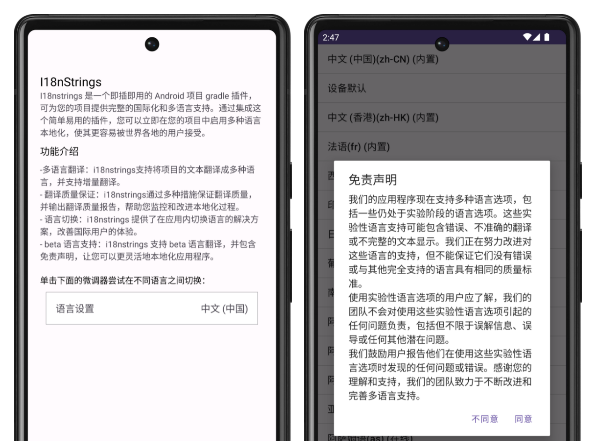

# I18nStrings

**I18nStrings** 是一款即插即用的 Android 工程 Gradle 插件，旨在为您的项目提供完善的国际化和多语言支持方案。集成这款用户友好的插件后，您能即时为项目激活广泛的语言本地化功能，进一步推动全球用户的接纳和使用。

## 功能

- **多语言翻译：** I18nStrings 支持项目文本的多语言翻译，并可执行增量翻译。
- **翻译质量保证：** 通过多重措施，I18nStrings 确保翻译的高质量，以优化多语言支持效果（[详情：翻译质量保障](doc/quality_cn.md)）。
- **语言切换：** I18nStrings 提供了在应用内切换语言的一体化解决方案，并支持应用动态翻译语言，从而增强了国际用户的使用体验。
- **Beta 语言支持：** I18nStrings 的 Beta 语言翻译功能附带免责声明，从产品层面赋予应用本地化更多灵活性。



## 快速上手

1. **添加依赖**：在工程根目录的 `build.gradle` 中添加以下代码：

```kotlin
dependencies { 
   ...
   classpath("com.appkim.i18nstrings:plugin:0.0.8") 
}
```

2. **添加插件支持**：在主模块（一般是 app 模块）的 `build.gradle` 中添加：

```kotlin
plugins {
   ...
   id("com.appkim.i18nstrings")
}
```

3. **运行 Task**：命令行中执行 `./gradlew :app:i18nStrings` 或在 Android Studio 中选择 `app`（主模块名称）-> `other` -> `i18nStrings`，双击执行。


4. **额外配置**：您还可以在主模块的 `build.gradle` 中添加 `i18nStrings` 配置，自定义任务修改。

```kotlin 示例代码
/**
 * 定义自定义扩展属性类，用以配置多语言翻译选项。
 *
 * release和beta字段接受以下值：
 *    - "default"： 默认值，将在release下读取app模块中存在的多语言目录，作为需翻译的多语言列表。
 *    - "suggest"： 推荐翻译语言，包括简体中文、法语、德语、印度尼西亚语、日语、葡萄牙语、西班牙语等。
 *    - "all"： 所有支持翻译的语言，共计100多种。请注意，对于600条文案的内容，翻译可能需要1-2小时，因此推荐使用"suggest"选项。
 *    - 自定义语言列表，使用逗号分隔，例如："zh-rCN,fr,de,id,ja,pt,es"。
 */
i18nStrings {
   release = "zh-rCN, fr, es" // 配置翻译语言，输出到对应的values文件夹。默认值为"default"。
   beta = "ja, pt" // 配置beta版本翻译语言，输出到主工程的assets目录下，需配合com.appkim.i18nstrings.ui库使用。
   betaPath = "../out/test" // 自定义beta翻译文件的输出路径。
   excludeProjects = "mylibrary" // 默认会翻译工程所有模块，通过此选项排除特定模块。
   onlySupportedStringsXml = true // 默认为true，仅识别strings.xml文件。
   excludeXmls = "" // 当onlySupportedStringsXml为false时，此字段可用于排除特定的xml文件。
}

```

5. **注意事项**：插件的翻译默认基于 Google Translate 来实现的，因此需要确保当前网络能够访问 Google Translate。源码层面已支持Cloud Translation API，如需使用可基于源码调用插件使用，后续版本会提供选项支持引擎切换。

## I18nStrings集成到应用内切换语言

I18nStrings插件不仅提供了强大的本地化支持，还通过其UI模块使应用内切换语言和实时翻译变得轻而易举。以下是集成步骤：

1. **添加依赖**：在主模块（通常是app模块）的`build.gradle`文件中添加i18nstrings UI模块依赖。

   ```kotlin DSL
   dependencies {
       ...
       implementation("com.appkim.i18nstrings:ui:0.0.8")
   }
   ```

2. **初始化**：在程序的`Application`类的`onCreate()`方法中初始化I18nStrings。

   ```kotlin
   class SampleApplication : Application() {
       ...
       override fun onCreate(): {
           return I18nStringsApp.init(applicationContext)
       }
   }
   ```

3. **注入Context和Resources**：必须对`Application`和`Activity`的Context和Resources进行包装，以便在切换语言时能够重新加载资源。

   `Application` class:

   ```kotlin
   class SampleApplication : Application() {
       ...
       override fun getResources(): Resources {
           return AppLocale.wrapResources(applicationContext, super.getResources())
       }
   }
   ```

   如果程序的Activity拥有共同的基类`BaseActivity`，则在其中添加以下代码，否则需要在所有的activity中添加：

   ```kotlin
   abstract class BaseActivity : AppCompatActivity() {
       override fun getDelegate(): AppCompatDelegate {
           return I18nStringsApp.getAppCompatDelegate(this, super.getDelegate())
       }
   }
   ```

4. **布局设置**：在布局文件中添加`I18nSettingView`，提供应用内多语言切换。

   ```xml
   <?xml version="1.0" encoding="utf-8"?>
   <LinearLayout xmlns:android="http://schemas.android.com/apk/res/android"
       xmlns:app="http://schemas.android.com/apk/res-auto"
       xmlns:tools="http://schemas.android.com/tools"
       android:layout_width="match_parent"
       android:layout_height="match_parent"
       android:orientation="vertical"
       android:padding="20dp">
   
       ...
       <com.appkim.i18nstrings.ui.I18nSettingView
           android:id="@+id/language_setting"
           android:layout_width="match_parent"
           android:layout_height="wrap_content"
           android:layout_marginTop="20dp"
           android:layout_margin="10dp"
           android:background="@drawable/custom_border"/>
   </LinearLayout>
   ```

5. **额外配置**：可以通过以下代码配置实时翻译和加载本地多语言文案等选项。

   ```kotlin
   object I18nStringsApp {
       var supportedRealtimeTranslate: Boolean = true //是否支持app实时翻译
       var supportedLocalTranslateFile: Boolean = true //是否支持加载本地存储下的多语言文案
       var localTranslationDir: String = "" //多语言文案文件在本地存储的位置
   }
   ```

6. **第三方库支持**：应用内语言的切换实现采用开源的库[restring]，更多使用方法请参考[restring](https://github.com/B3nedikt/restring)。

7. **注意事项**：应用程序中的“在线”翻译功能是通过 Google Translate 来实现的，因此需要确保当前网络能够访问 Google Translate。该功能主要用于产品测试，旨在快速展示应用在不同语言环境下的显示效果。若需在商业环境中使用，请务必替换为具有商业授权的翻译引擎，例如 Cloud Translation API。

通过以上步骤，你可以轻松地为你的应用添加多语言支持，并为全球用户提供更优质的体验。


## 依赖

- Android Studio 4.1 或更高版本
- Java 8 或更高版本
- Gradle 7.4 或更高版本

## 许可证

I18nStrings 遵循 Apache License 2.0 许可证。

无论您正在为本地用户还是全球观众开发应用，I18nStrings 都有助于轻松实现本地化。

---